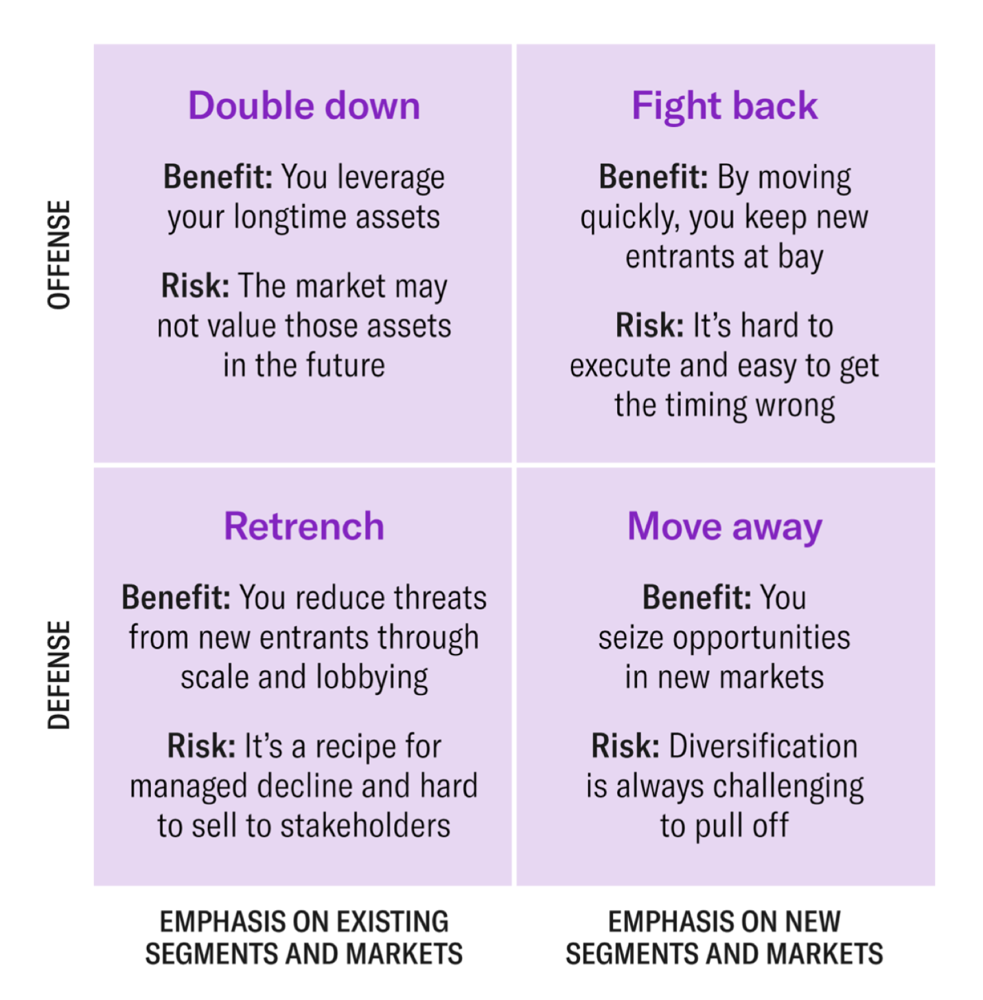

[TOC]

# Week 1: Disruptive Technologies

## 1 创新者困境介绍视频

主导行业的成功公司 因为颠覆性创新 而失败.
对于大公司的领导是警告; 对和对抗大公司的人来说是鼓励.

持续创新: 根据最好和最大客户的反馈进行产品改进的时候: 减少缺陷, 使某些东西更快或更强大.
颠覆性创新:  导致市场重视的许多关键功能性能降低: 更多缺陷, 更低速率功率,  拥有复杂且要求严格的大公司无法采取这种技术

==困境核心: 持续创新 满足当前客户的需求 但 商业中的颠覆性技术却不断发展满足未来客户的需求==

持续创新 短期内 或许更有意义, 可能导致公司失败, 投资给未经证实的机会上是没有意义的, 但却是公司的未来 .

颠覆性创新通常源于 利基市场中存在的需求, 这种需求被当前市场产品 所忽视; 例子: 手机相机.

为什么大公司走不到颠覆性创新前呢?
- 鉴于市场规模较小, 这种技术缺乏吸引力, 成功公司不能将资源投入到 小型且未经 验证的产品上, 对大公司的未来意味着: 颠覆性创新短期内可能没有意义, 但**不能忽视它! **, 公司要聆听客户的声音, 一边继续成功地持续性创新, 一边发现潜在的颠覆性创新.

(对于初创公司来说是好事, 只要他们的创新有潜力 快速提高绩效, 初始市场小是好事, 有更多时间微调他们的技术, 他们对规模大的竞争对手的冷漠感到惊讶.)

## 2
pdf

## 3
一种新的增长理论, 其根源在于微观经济层面, 而不是经济学家自上而下的视角. 我希望该模型可能足够有用, 帮助解释为什么一些经济已经停滞; 什么可以使一个贫穷的国家变得繁荣, 所以我不知道这些是否会起作用.

什么导致成功的公司失去增长并最终失败:

有一个隐藏的事实 就是低成本战略只有在你的市场上, 有高成本竞争对手的情况下才有效, 一旦他们逃离高端市场, 那么这只是低成本小型工厂与别的低成本小型工厂竞争, 价格相互低到甚至不赚钱 

颠覆性创新: 大型工业电脑很大 很难操作, 突然出来了个人计算机, 功能一代比一代好, 几乎不需要大型机, 直到大型机消失. 大型机从来没关注过小小的个人计算机, 卖一个出去就很少的利润, 因此追求这种小个人计算机没有意义, 之后智能手机也是相同的逻辑, 纯利润更少. 
提供更多工作机会: 更多人使用购买就意味着雇佣更多人.

持续性创新: 他们不会创造就业机会

效率创新:  可以坐下来出售 向相同用户提供相同的产品但价格更便宜, 消除了就业机会, 但是释放了资本!

日本崛起的例子, 全是颠覆性创新. 但现在不行了, 小鬼子扰乱美国的速度比西欧还要快 

亚洲内卷房怎么造成的?  
无正确答案: 丰田的小绵羊, 质量一般 但很多人都能买得起, 之后等到利润拉长 就转变成持续性创新

对利益的追求

印度冰箱 特殊化学材料 输入指定方向的电子 吸热 从而变成 冰箱: 买的人多了 就得雇佣更多的人去制造, 让零售商去卖, 新的方式去分发, 在店里出售以前不可能出售的东西冷东西, 更多的人可以做更多的事情 

所以 开头的问题 什么可以让一个贫穷的国家变得繁荣? 颠覆性创新可能是繁荣的重要因素 

美国的宏观经济繁荣或停滞是有微观经济原因的  

"Gilder's Axiom for Inputs"吉尔德的投入公理:

**Inputs that are plentiful and cheap can be used abundantly and without account.** 

充足且廉价的资源可以不加限制地大量使用

**But carefully deploy inputs that are scarce and costly. Measure their efficiency in each application, so that you can optimize its productivity.** 

意思是: 但对于稀缺且昂贵的资源, 应该谨慎使用. 要在每种应用中衡量其效率, 以便优化其生产力.

## 4
pdf

## 5
pdf

## 6
pdf

## 7
即将成为下一场革命的技术总是在现有范式中发展, 然后才能阐明为一场革命.
技术耗尽, 市场耗尽, 完全饱和, 头顶上官僚主义一层套一层, 之后突然又有新技术了!
一旦有了汽车, 就改变了整个领域, 自行车火车全都pass,   出现了道路网络, 燃料分配网络, 电力网络, 甚至还道路网络, 燃料分配网络, 电力网络, 甚至还需要电话, 所有的这些都是这场革命的基础设施.

所有的这些都是在突破, 在革命, 想象从帆船到蒸汽船

## 8
历史经验告诉我们 我们正处于塑造未来的适当时刻
明智的绿色增长是我们实现社会可持续未来的最佳选择 (不止是环境)
已经发生了5次技术革命! 
每一次都能带来技术、经济、社会制度的 转变, 它几乎可以改变一切
先有一个安装期, 之后转折点, 之后部署期
我们正在转折点, 处于可以拥有黄金时代的时刻, 我们要控制好金融, 之后致力于生产, 社会和整个经济 
就像上世纪30年代和现在一样, 现在世界一样魔幻, 一堆问题, 确实是存在巨大的技术潜力, 知识缺乏明显的协同作用, 指导一个方向,  每个人都开始前进, 迈向更好的社会, 离这个目标还很远

现在黄金时代的方向有两个特征定义, 一个是活跃的状态; 一个是一种新的生活方式. 后者必须得到推广 得到帮助, 提供足够的动感需求, 也就能提供足够的供应, 这就是一个新的创新! 

绿色增长 提高GDP和生活方式, 我们正在进行循环经济和服务 经济

民粹主义之所以搞破坏 还不是因为环境不好 才揭竿起义的, 所以才要改良生活状态, 从而生成良性循环

现在不仅仅关注绿色环境, 社会也得多关注关注

## 9
创造性破坏是 商业周期的自然组成部分, 不断变革的工业突变过程, 经济结构从内部不断地摧毁旧的结构, 到 不断创造新的结构

对信息革命的新绿色全球时代思考的核心要素: 
资本主义每隔 40-70年 自我重塑一次, 每次带来新的知识 
普遍通常的技术 决定了我们如何生产, 消费和组织我们的机构
有些技术需要风险融资来发展, 最初的成功带来投资狂潮, 最终导致重大金融泡沫, 不可避免的崩溃带来衰退和社会动荡, 倾向于追随新的民粹主义
微处理器开始之后, 我们就处在泡沫余波中, 世界处于系统危机之中, 转折点, 人类需要充分享受数字 革命的好处, 为此我们必须创造新的经济结构和新的 社会安全网

我们可以将信息革命塑造成绿色全球黄金时代, 首先必须是绿色的才能可持续性, 文化变革, 地球对于人类的脆弱性

社会最好的不是拥有, 而是幸福! 知识创造力健康经验和与他人的沟通, 真正耐用的产品(好的资本) 终身学习, 未来必须是全球性的, 对于发达国家的慷慨和自私, 人道主义

发展会创造市场吗? 可以的, 想想之前文献中的循环, 这样其实移民也会减少, 如果移民, 那他们的国家会失去大脑失去勇气, 失去了所有的价值

不是全球化, 是重塑全球化, 一直在追求低成本, 它需要更多的传播, 每个国家都必须考虑产业政策, 国家和企业之间双赢, 从而整个社会都能双赢, 而不仅仅是少数人获取利益

将产品转换为服务, 不能让穷人越穷, 富人越富

两个举措: 政府行动, 企业和社会之间双赢; 生活方式的改变, 塑造一系列机会, 让世界朝着更好方向发展, 智能绿色全球黄金时代

因为ai失去工作的人: 每一次信息革命, 经济结构中一部分会使用这些高科技的东西, 很高性能, 改善了生活, 想想美国二战制造飞机汽车, 郊区的人也需要服务的啊, 创造了数不胜数的就业机会. 也就是用ai作为有非常高生产力的事物将创造额外财富, 重新生活重新创造,  但要达成共识, 不能征服一言堂,  

## 10
技术 指的就是 digital  将世界上所有东西都说成digital是愚蠢的 
一定要思考技术在历史当中的地位: 大多工作都集中在一起非常特殊的发明的早期历史上, 而不是着眼于人类实际使用的东西. 我们对物质世界的描述在时间上存在偏差.   

对于技术 不进行量化是不行的 不能光相信技术会改变世界  不要问世界上所有计算机停止使用会发生什么 而是要问如果我们有某种替代方式代替计算机 那使用这个替代方案和使用计算机对我们的社会表现有何不同 
多问问为什么事情会像这样发展? 今天所有的变化都被数字化了

反对新技术特定争论的人是不对的, 他们希望保持世界现状, 笑话.

有很多新技术可供选择, 我们必须拒绝 大多数新技术, 因为我们不会生活在拥有十种不通电话和不同运输机器的时代, 确实是需要减少数量, 也算是一种拒绝了. 科学家工程师投资者一直在做的事情. 

评估某种特定技术的重要性的影响是很困难的, 大多数对未来的预测都是错误的, 因为没有认真思考, 充满技术消极和基础知识, 宣传性正能量和负能量的矛盾社会中.

技术倡导者和批评者都是错误的, 科技的故事是一个没有被讲述的故事, 需要分析需要理解调查的故事, 因为我们对到底发生了什么可能并没有什么理解, 但是不能把对炒作的批评和科技的批评混为一谈.

过去的主张大都是宣传, 其分析也没有什么依据

创新的政策 还是有问题的, 得改善, 得大胆创新, 不能天天复现别人的文章

现在大多数创新 还是保密的, 公众其实并不知道现在正在发明什么, 什么将有一个全球性的看法, 这些都不知道.  只有经过精心选择的宣传照片.

## 11
pdf

## 12
pdf
