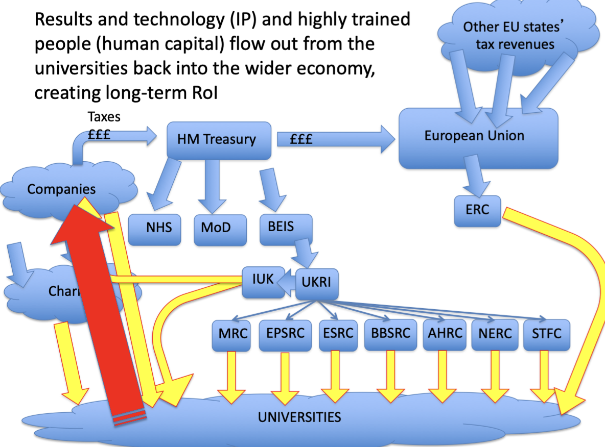
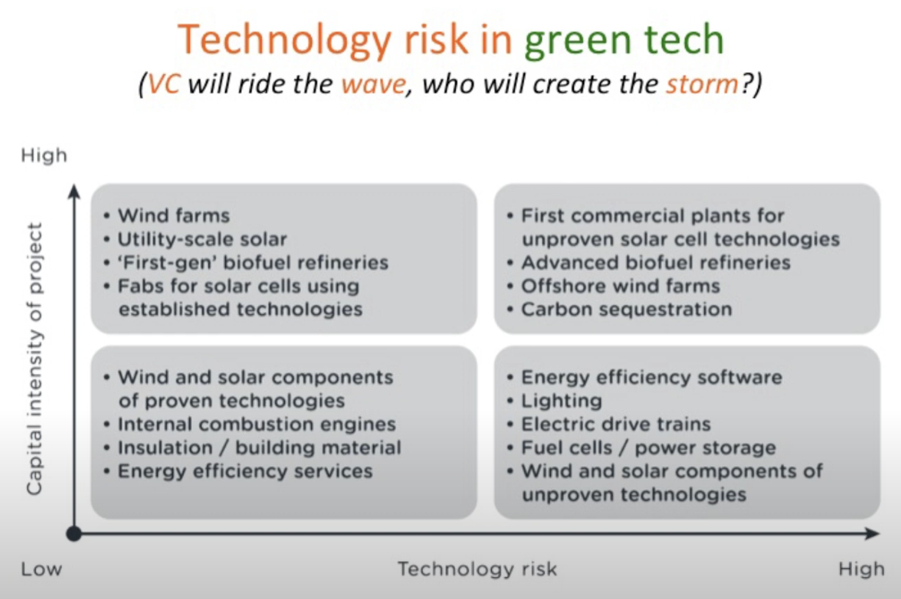

[TOC]

# Week 4: Financing Innovation

## Reference 0-a: HOW UK public funds support research&innovation

有些研究人员用纸笔或廉价电脑就能achieve great things, 但绝大多数研究都需要funding支付resources:
1. Equipment (infrastructure) — 用于研究的工具.
2. 消耗品 Consumables (研究中消耗的物品).
3. 人: 首席研究员Principal Investigator (PI) to lead / direct the work; 与PI合作的共同研究员Co-Investigator (CI); 执行工作的研究人员/工程师.
4. 差旅Travel: 用于合作collaboration或传播成果dissemination
5. 管理费Overheads: 运营办公室/实验室的成本
**资源是稀缺的scarce, 要申请.**

考虑 corporate context:
许多创新随着时间的推移逐渐商品化.
引入 新/创新 技术, 增加 企业/客户的感知或实际价值, 但必须是cost-effective的.
Internal R&D needs ROI to be monitored (准确评估可能非常困难).
Open innovation A&D (收购与开发) 需良好ROI估算用于收购.

考虑公共部门 public-sector context:
不是所有研究都是为了商业目的, 也不是为了ROI.
Blue-Sky 或者 basic research是foundational, pre-commercial, 来自pure scientific or engineering curiosity (解决开放性问题有时或是重大挑战).
历史上, 只有极少数公司能够为Blue-Sky的支出负责 (因为ROI不足, 或只是模糊不清): 失败概率也很大因此Blue-Sky成本高昂. 
历史上几乎所有蓝天研究都是由non-profit institutions进行的: universities and charitably-funded labs.
公共资金(即纳税人的钱) 或慈善捐款资助: Funded by public money (tax-pounds) or charitable donations.
但在过去20年里, 大学越来越重视研究影响力research impact: 另一种形式的ROI.

- 黄色箭头指示的资金流 需research proposals.
- Results and technology (IP) 及 人才 (human capital) 从大学back into到更广泛的经济领域, 形成长期ROI.

## Reference 0-b: 创建start-up公司
初始的 种子基金seed funding 通常用于 覆盖cover 早期的 "死亡之谷"valley of death阶段, 直到收入大于零.

种子基金种类:
1. Founders: 通过储蓄贷款和或购买股份 (sweat equity是分配给员工的股权用以代替工资支付其时间/努力).
2. FFF: Friends & Family Funding.
3. Angel Investors: 有钱人通过贷款或换取股权注入自己的资金.
4. Venture Capital (VC): 代表(大量的)其他人管理资金.

此后进行多轮 风险投资 增长融资 successive rounds of VC growth funding:
1. First & Second Round
2. Third-Round
3. Fourth-Round: finance the exit process: 为退出流程提供资金: IPO或被"大型公司"收购.

## Reference 1: Rutger Bregman的文章解释Entrepreneurial State中Mazzucato's core thesis
pdf

## Reference 2: Mariana Mazzucato TED演讲
国家和市场的并行有非常大的影响力, 超越某些决策者所在地区的创新政策之上.

美国所做的远比单纯修复市场失灵多得多, 它实际上是塑造和创造市场, 不仅给基本研究投资(典型公共利益), 还给应用研究投资. 政府需要在创新科技上冒大险.

国家对于奠定研发的基础非常重要, 但它并不是那种高风险的革新性创新本身. 互联网发展进程中好多好多资金其实都是来自国家. 

十次创新可能就有一次是成功的, 国会老爷们也知道, 但他们愿意为那些有过一次成功的失败者提供资金, 这其实有很大意义.

国家投入资金之后收税, 看似正常但事实并非如此: 因为许多就业的岗位在国外, 也就是全球化, 这无可厚非; 真正需要考虑的是公司确实从政府那里拿到了很多钱, 所以  需要有一个合理的利润回报机制, 让这些公司回报比税收更多给政府: 发行股票? 或者创建"创新基金", 互联网0.5%的利益也会有更多的钱投资到绿色科技上.

政府最好能成为价值生成机制的主导者: 在市场经济中充当创造价值的特殊一员.

## Reference 3: Mariana Mazzucato在The Long Now Foundation谈论The Entrepreneurial State
说服人们,  如果我们要培育你们的任何方面,  我们绝对必须改变我们谈论国家的方式: 公私合作 伙伴关系.

虽然我们讨论了很多关于private sectors问题比如推动创新和推动增长, 但我们低估了关于国家作用的动态, 而且我们在经济理论中媒体中政客中谈论的词语也是有问题的. 

现在提倡不仅智能创新引领的增长, 这是极其重要的, 但我们还希望增长更具包容性, 减少不平等, 更加可持续. 这需要大规模的创造性思维和公共部门, 现在不只是金融危机还有思维危机.

经济学家谈论公共部门作用的方式非常非常有限, 关于修复市场中存在不同类型的问题, 比如拥有像基础研究这样的公共产品时, 很难从中获得回报, 那么你就会出现市场失灵, 因此政府必须进行干预提供资金. (很有限的观点)

种子融资时风险最大, 所以通常是政府资助.

这里所说的国家不是指部委, 而是不同机构的去中心化网络.

苹果手机的例子不是为了强调军工联合体! (联想open 和 close innovation的区别)

谁在为绿色领域提供资金? VC从来都不他妈缺钱, 只是他们不敢投资. 他们的模型是基于退出的, 想要短期回报. 

今天的创新取决于昨天的创新, 它是积累的, 而我们所拥有的实际上是因为我们没有关于谁真正为创新做出贡献的正确故事. 

中国面临的问题是政府结构的自上而下(生态系统), 如果是公共和私人机构组成的去中心化网络动态互动, 这个东西会更成功. 研发支出有增长, 但还是不够. 日本的横向联系结构以及创新系统, 在机构之间存在很多动态联系. 苏联没有与科学行业的联系, 最高层的人从来不去看看车间里发生了什么, 损坏活力和系统.

## Reference 4: Stian Westlake对Mariana Mazzucato提出有趣批评
pdf

## Reference 5: Eric Ries和Jim Euchner交谈总结The Lean Startup关键点; 大公司可以从创业公司学到什么
pdf

## Reference 6: Eric Ries的书介绍会
组织新产品开发的方式可能是错误的. 最大浪费不是低效构建产品, 而是非常高校地构建没人想要的东西. 

我们投入的大部分精力都在浪费很多人的时间: 车库里两个人的创业精神, 颠覆性创新等词汇. 

企业无处不在, 成为企业家的关键不在于你吃什么面, 而是身处的经营环境. 在意想不到的地方都有企业家. 

企业开发部门在决定如何收购初创公司, 收购哪些初创公司以及如何将它们整合到母公司时所遇到的问题, 与试图在内部创建全新初创公司的内部创新者所面临的问题完全相同. 我们缺乏指导我们行为的创业理论. 

我们这个时代的主要问题不是它能被建造, 而是它应该被建造. 问题是我们能否围绕特定产品建立可持续的业务. 

快要失败的时候, 别考虑还有几个月的时间, 考虑还有几次转型的机会. 

客户是上帝, 但如果不知道客户是谁呢? 一些产品找人帮忙看说是很好, 但是邀请朋友来, 就不干了. 你要是不知道客户是谁, 你就不知道质量意味着什么.

失败没事, 总是可以声称获得了良好的学习经历. 

虚荣指标和新闻稿可以考虑, 让竞争对手感觉不好, 但不是正路; 如果我们使用这些数字来指导我们自己的业务时就是自欺欺人; 相反, 建立基线, 开发一个Build a Minimum Viable Product (MVP), 用于测试和验证核心假设, 测量和观察客户的当前行为, 以便了解产品的市场反应; 之后调整引擎, 通过实验和迭代, 看看是否可以从基线开始提升关键指标; 最后转型或者坚持.

## Reference 7: Harvard Business上关于Reid Hoffman和Blitzscaling的文章
pdf

## Reference 8: Reid Hoffman讨论Blitzscaling
过pass

## Reference 9: D. F. Kurato, H. L. Holt, & E. Neubert 关于Blitzscaling的评论
pdf

## Reference 10:  Guy Kawasaki's The Art of the Start 2.0
成功创业的步骤: 
1. 如何提出好想法并获得反馈.
2. 如何领导团队实现共同愿景, 以及如何通过传播, 社交和合作来成长.

第一, 在创业初期, 扩展能力被高估了. 我们必须抵制住想得太大, 太快的诱惑. 因为首先大多数start-ups在这一点上无论如何都无法通过扩展测试; 其次找到一种能够创造意义的产品更为重要. 没有一家初创公司因为不知道如何扩展而消亡.

第二, 有意义的故事激发人们对您和您的产品的信心, 我们受到太多信息的轰炸, 唯一的参与方式就是通过有力的故事讲述. 作为企业家, 我们必须推销不同未来的愿景. 就事实而言, 产品速度快十倍或功能强大十倍是不够的. 我们需要对故事进行个性化处理, 以使这些事实具有相关性. 能够移山的是信念, 而不是事实.

第三, 幸福的无知具有极大的力量: 具有长期行业背景的专家知道事情是如何运作的, 但他们也受到这些知识的限制. 相反, 新的和未经证实的团队可以质疑一起, 并提出非常创新的解决方案. 

## Reference 11:  Guy Kawasaki TED talk: The Art of Innovation
思考, 定义, 创造的主题都是创新. 

创造意义才是最重要的, 而不是赚钱的愿望. 创造意义 意味着 你改变世界 (你也可能会赚钱). 但如果你一开始就只想赚钱, 你可能不会赚钱, 你不会创造意义, 你不会改变世界, 而且你很可能会失败.

第一个想法是 确定如何创造意义, 你怎样才能改变世界. 当你决定你所表达的含义时, 尝试找到两三个单词, 来描述为什么该含义应该存在, 而不是50字的使命宣言也不是两三个字的口头禅. 

其次是视角问题: 视角是跳跃曲线, 不要停留在你现在所处的同一条愚蠢的曲线上, 不要试图把事情做得只是好10%. 大多数公司根据他们所做的事情而不是利益来定义自己. 

跳到下一个曲线的时候, 革命中存在一些蹩脚元素是可以接受的, 在下一个曲线上推出具有革命性, 创新性的东西, 其中包含蹩脚的元素. 

人们会以你想不到的方式使用你的产品, 这些人将是你根本没有预料到会使用它的人. 定位和品牌取决于消费者的决定而不是你的决定. 

出色的产品, 出色的服务, 出色的创新使人们两极分化. 不要害怕. 

要成为创新者, 否认那些反对你的人; 但一旦发货了, 你就要开始倾听人们的意见并搅动你的产品. 

价格和独一无二的关系: 如果很贵的东西是可以被替代的, 就要打价格战; 有一些独一无二的东西只有你做但却没有价值, 愚蠢的. 

如果你是创新者, 你就必须学会推销. 从为观众定制的东西开始.

十张幻灯片, 20min, 字体大小: 观众中年龄最大的人年龄除以二.
